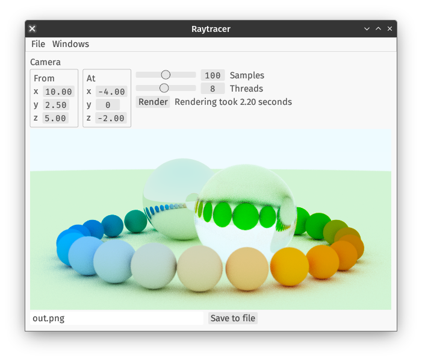

The Rust implementation can be run from the commandline like the others:

```
cargo run --release -- -n100 -t8 -oout.png
```

It can also be run through an optional gui enabled via the `gui` feature:

```
cargo run --release --features=gui
```


